# device_soc_telink

-   [简介](#简介)
-   [开发环境](#开发环境)
-   [安装工具](#安装工具)
-   [获取源码](#获取源码)
-   [确认目录结构](#确认目录结构)
-   [编译工程](#编译工程)
-   [烧录固件](#烧录固件)
-   [相关仓库](#相关仓库)

## 简介

本仓库为泰凌微电子（Telink Semi）公司的TLSR9系列芯片相关代码仓库，用于存放与SoC芯片相关的SDK及适配代码。
使用同一系列SoC，开发不同的device或board时，可共用该仓库代码进行开发。

## 开发环境

推荐采用Windows+Ubuntu环境进行开发：

-   Windows环境用于编写代码、下载程序和烧入固件等，系统要求：Windows 10 64位系统。

-   Linux环境用于代码下载、编译工程和生成固件等，系统要求：Ubuntu 20.04 64位及以上版本。

    - 若不确定所使用的Linux设备的系统及版本，请在bash中运行如下命令查看：

    ```bash
    lsb_release -a
    ```

    - 请在确认Linux系统不低于`Ubuntu 20.04.XX LTS`的情况下执行后续的步骤；否则，请升级或更换合适的Liunx设备。

> 若需要支持在Linux与Windows之间的文件共享以及编辑，请在Linux设备上适当地安装和配置samba、vim等常用软件。

## 安装工具

本仓库包含的编译构建脚本和打包镜像工具等，需要在Linux环境上执行。

本章节参考了OpenHarmoney文档《搭建轻量与小型系统》，[请点击查看详情](https://gitee.com/openharmony/docs/blob/master/zh-cn/device-dev/quick-start/quickstart-lite-env-setup.md)。

### 安装repo

码云repo是一种代码版本管理工具，可以用来打包获取OpenHarmony的源码。

1. 在home文件夹下创建repo安装目录：

    ```bash
    mkdir ~/bin
    ```

2. 下载repo至安装目录：

    ```bash
    wget https://storage.googleapis.com/git-repo-downloads/repo -P ~/bin/
    ```

3. 改变执行权限：

    ```bash
    chmod a+x ~/bin/repo
    ```

4. 在~/.bashrc文件的末尾，额外加入以下内容，配置环境变量：

    ```bash
    # set environment for repo
    export PATH=~/bin:$PATH
    export REPO_URL=https://mirrors.tuna.tsinghua.edu.cn/git/git-repo/
    ```

5. 重启bash或执行以下命令让环境变量生效：

    ```bash
    source ~/.bashrc
    ```

### 安装常用库和工具

使用如下apt-get命令安装后续操作所需的库和工具，用于编译C/C++代码：

```bash
sudo apt-get install build-essential gcc g++ make zlib* libffi-dev e2fsprogs pkg-config flex bison perl bc openssl libssl-dev libelf-dev libc6-dev-amd64 binutils binutils-dev libdwarf-dev u-boot-tools mtd-utils gcc-arm-linux-gnueabi
```

### 安装Python3

本项目要求安装Python 3.8及以上版本，本文档以Python 3.8为例。

1. 在bash中输入下列命令，查看python版本：

    ```bash
    python3 --version
    ```

    如果不低于3.8，可以忽略第二步的重新安装，从第三步的设置开始。

2. 如果Python版本低于3.8，不建议直接升级，请按照如下步骤重新安装。

    ```bash
    sudo apt-get install python3.8
    ```

3. 设置python和python3软链接为python3.8。

   查看python3.8的位置：

   ```bash
   which python3.8
   ```
   将python和python3切换为python3.8：

   ```bash
   sudo update-alternatives --install /usr/bin/python python /usr/bin/python3.8 1  
   # /usr/bin/python3.8 为上一步查看的python3.8的位置
   sudo update-alternatives --install /usr/bin/python3 python3 /usr/bin/python3.8 1 
   # /usr/bin/python3.8 为上一步查看的python3.8的位置
   ```

4. 安装并升级Python包管理工具（pip3），任选如下一种方式。

   - **命令行方式：**

     ```bash
     sudo apt-get install python3-setuptools python3-pip -y
     sudo pip3 install --upgrade pip
     ```

   - **安装包方式：**

     ```bash
     curl https://bootstrap.pypa.io/get-pip.py -o get-pip.py
     python get-pip.py
     ```

### 安装ohos-build

在安装ohos-build之前，请确保已安装Python 3.8及以上版本；否则，请[安装Python3](#安装python3)。

1. 在bash中运行如下命令安装ohos-build:

   ```bash
   python3 -m pip install --user ohos-build
   ```

2. 执行"hb -h"，有打印以下信息即表示安装成功：

   ```bash
    usage: hb [-h] [-v] {build,set,env,clean} ...

    OHOS Build System version 0.4.6

    positional arguments:
    {build,set,env,clean}
        build               Build source code
        set                 OHOS build settings
        env                 Show OHOS build env
        clean               Clean output

    optional arguments:
    -h, --help            show this help message and exit
    -v, --version         show program's version number and exit
   ```

### 安装Telink的编译工具链

目前，社区中的RISCV32交叉编译工具链还未适配，可能会出现兼容性问题。
因此，推荐使用来自[Telink官方网站](http://wiki.telink-semi.cn/wiki/IDE-and-Tools/BDT_for_TLSR9_Series_in_Linux/)的Telink RISC-V Linux Toolchain。

1. 下载工具链

    可以[点击下载该编译链工具](http://wiki.telink-semi.cn/tools_and_sdk/Tools/IDE/telink_riscv_linux_toolchain.zip)，并解压到用户自行指定的位置。
    或者，也可以使用下列命令下载并解压。

    ```bash
    wget http://wiki.telink-semi.cn/tools_and_sdk/Tools/IDE/telink_riscv_linux_toolchain.zip
    unzip telink_riscv_linux_toolchain.zip
    ```

2. 设置依赖项：

    ```bash
    sudo dpkg --add-architecture i386
    sudo apt-get update
    sudo apt-get install -y libc6:i386 libncurses5:i386 libstdc++6:i386
    ```

3. 在~/.bashrc文件的末尾，根据该toolchain解压后所存放的路径，加入环境变量：

    ```bash
    # set environment path for TELINK toolchain
    RISCV=telink_riscv_linux_toolchain/nds32le-elf-mculib-v5f
    export PATH=~/$RISCV/bin:$PATH
    ```

4. 保存后，重启bash或执行以下命令使环境变量生效：

    ```bash
    source ~/.bashrc
    ```

## 获取源码

在Linux环境下通过以下步骤获取OpenHarmony源码。

本章节参考了OpenHarmoney文档《搭建轻量与小型系统》，[请点击详情查看详情](https://gitee.com/openharmony/docs/blob/master/zh-cn/device-dev/quick-start/quickstart-lite-env-setup.md)。

1. 新建代码存放目录(用户可以自行指定为其他目录)，如`openharmony`，并进入该目录：

    ```bash
    mkdir ~/openharmony
    cd ~/openharmony
    ```

2. Repo初始化，指定码云上面OpenHarmony的manifest仓库中所包含的git仓库：

    ```bash
    repo init -u https://gitee.com/openharmony/manifest --no-repo-verify
    ```

3. 仓库初次同步，下载码云上所需的git仓库的代码。

    ```bash
    repo sync -c
    ```

    这里下载的过程的耗时可能会很长，请耐心等待。

4. 下载好代码后，下载大容量二进制文件。

    ```bash
    repo forall -c 'git lfs pull'
    ```

## 确认目录结构

在Linux环境下的源码的根目录下，可以查看SoC目录以及其他与Telink相关文件的目录结构。

### SoC目录

在device文件夹下，确保device/soc目录结构如下（截至2022年6月1日）：

```bash
user:~/openharmony/device/soc$ tree -L 3
.
└── telink
    ├── b91                                     # b91 SoC适配目录
    │   ├── adapter                                 # 外设驱动、BLE、文件系统适配
    │   ├── b91m_ble_sdk                            # liteos b91 SDK适配
    │   ├── BUILD.gn                                # GN构建脚本
    │   ├── hcs                                     # 设备描述文件
    │   ├── hdf                                     # HDF设备驱动框架目录
    │   ├── Kconfig.liteos_m.defconfig.b91          # b91 Kconfig默认配置
    │   ├── Kconfig.liteos_m.defconfig.series       # series Kconfig默认配置
    │   ├── Kconfig.liteos_m.series                 # series Kconfig配置项
    │   ├── Kconfig.liteos_m.soc                    # SoC Kconfig配置项
    │   ├── liteos.ld                               # 链接脚本
    │   └── liteos_m                                # liteos_m 各模块实现
    ├── BUILD.gn                                # GN构建脚本
    ├── End User License Agreement.md               # 终端用户证书协议
    ├── images                                      # README插图文件夹  
    .   ├── ...                                     # 插图
    │   └── ...                                     # 插图
    ├── Kconfig.liteos_m.defconfig              # liteos_m Kconfig默认配置
    ├── Kconfig.liteos_m.series                 # liteos_m series配置项
    ├── Kconfig.liteos_m.soc                    # liteos_m SoC配置项
    ├── LICENSE                                     # 证书文件
    ├── OAT.xml                                     # 开源仓审查规则配置文件
    ├── README.md                                   # 英文版README
    ├── README_zh.md                                # 中文版README
    └── util                                    # 工具项目录
        └── util.gni                                #  固件生成脚本

```

### Board目录

在device文件夹下，确保device/board目录结构如下（截至2022年6月1日）：

```bash
user:~/openharmony/device/board$ tree -L 3
.
└── telink
    ├── b91_devkit                              # B91 Generic Starter Kit开发板配置目录
    │   ├── b91_devkit_defconfig                    # B91 Generic Starter Kit Kconfig默认配置
    │   ├── BUILD.gn                                # GN构建脚本
    │   ├── Kconfig.liteos_m.board                  # Board liteos_m Kconfig配置项
    │   ├── Kconfig.liteos_m.defconfig.board        # Board liteos_m Kconfig默认配置
    │   └── liteos_m                                # 构建脚本目录
    ├── BUILD.gn                                # GN构建脚本
    ├── drivers                                 # 板级驱动存放目录
    │   └── BUILD.gn                                # GN构建脚本
    ├── hcs                                     # hcs硬件描述配置目录
    │   ├── b91_devkit.hcs                          # B91 Generic Starter Kit hcs硬件描述脚本
    │   └── BUILD.gn                                # GN构建脚本
    ├── image                                   # README插图文件夹  
    .   ├── ...                                     # 插图
    │   └── ...                                     # 插图
    ├── Kconfig.liteos_m.boards                 # Board liteos_m Kconfig配置项
    ├── Kconfig.liteos_m.defconfig.boards       # Board liteos_m Kconfig默认配置
    ├── LICENSE                                 # 证书文件
    ├── OAT.xml                                 # 开源仓审查规则配置文件
    ├── README.md                               # 英文版README
    └── README_zh.md                            # 中文版README

```

### Vendor目录

在vendor文件夹下，确保vendor文件夹目录结构如下（截至2022年6月1日）：

```bash
user:~/openharmony/vendor$ tree -L 3
.
└── telink
    ├── b91_devkit_ble_demo                     # BLE应用示例工程
    │   ├── b91_gatt_sample                         # BLE示例代码
    │   ├── BUILD.gn                                # GN构建脚本
    │   ├── config.json                             # 子系统裁配置裁剪脚本
    │   ├── hals                                    # 产品参数配置
    │   ├── hdf_config                              # HDF硬件描述配置
    │   ├── kernel_configs                          # Kconfig配置输出
    │   └── ohos.build                              # 子系统模块单
    ├── b91_devkit_led_demo                    # LED测试示例工程
    │   ├── BUILD.gn                                # GN构建脚本
    │   ├── config.json                             # 子系统裁配置裁剪脚本
    │   ├── hals                                    # 产品参数配置
    │   ├── hdf_config                              # HDF硬件描述配置
    │   ├── kernel_configs                          # Kconfig配置输出
    │   ├── led_demo                                # LED示例代码
    │   └── ohos.build                              # 子系统模块单
    ├── b91_devkit_xts_demo                    # XTS测试示例工程
    │   ├── BUILD.gn                                # GN构建脚本
    │   ├── config.json                             # 子系统裁配置裁剪脚本
    │   ├── hals                                    # 产品参数配置
    │   ├── hdf_config                              # HDF硬件描述配置
    │   ├── kernel_configs                          # Kconfig配置输出
    │   └── ohos.build                              # 子系统模块单
    ├── LICENSE                                 # 证书文件
    ├── OAT.xml                                 # 开源仓审查规则配置文件
    ├── README.md                               # 英文版README
    └── README_zh.md                            # 中文版README     
```

## 编译工程

进入Linux环境下源码根目录，可以开始编译工程。

1. 设置工程根目录

    在bash中输入以下命令，可以将当前源码根目录为工程根目录：

    ```bash
    hb set -root .
    ```

    此时，会自动进入第二步中的产品选择界面。

    > 如果hb set命令提示报错，请先执行以下命令去构建并安装ohos-build

    ```bash
    python3 -m pip install --user build/lite
    ```

2. 选择样例产品：

    产品选择界面如下：

    ```bash
    # OHOS Which product do you need? (Use arrow keys)

    telink
        >b91_devkit_xts_demo
         b91_devkit_ble_demo
         b91_devkit_led_demo
         ...
    ```

    使用鼠标左击或者方向键`↑`和`↓`，可以选取需要编译的样例产品，按下回车键确定选项。    

    也可使用以下命令进行修改：

    ```bash
    hb set -p {PRODUCT_NAME}
    ```

    `{PRODUCT_NAME}`为产品选择界面中列举出来的样例的名称，如`b91_devkit_xts_demo`。

3. 编译

    后续修改了本样例产品中的文件，只需要执行以下命令进行编译，不需要再重复上述第一、二步去设置产品的根目录。

    ```bash
    hb build -f
    ```

    > 注意：若编译XTS项目，请在上述命令行中添加参数如下：

    ```bash
    hb build --gn-args 'build_xts=true' -f
    ```

    生成的固件位于工程根目录下：

    ```bash
    out/{BOARD_NAME}/{PRODUCT_NAME}/bin/{PRODUCT_NAME}.bin
    ```

    `{BOARD_NAME}`为主板名，为`b91_devkit`。

## 烧录固件

在Windows平台的环境下，烧录固件。

### 烧录工具

Burning and Debugging Tools(BDT)仅支持在Windows平台下安装和使用，其可执行安装程序为Telink BDT.exe。
[点击下载BDT](http://wiki.telink-semi.cn/tools_and_sdk/Tools/BDT/BDT.zip)

### 连接硬件

请按照下面的图示进行硬件连接。图中的紫线表示USB线，其他两根线表示杜邦线。

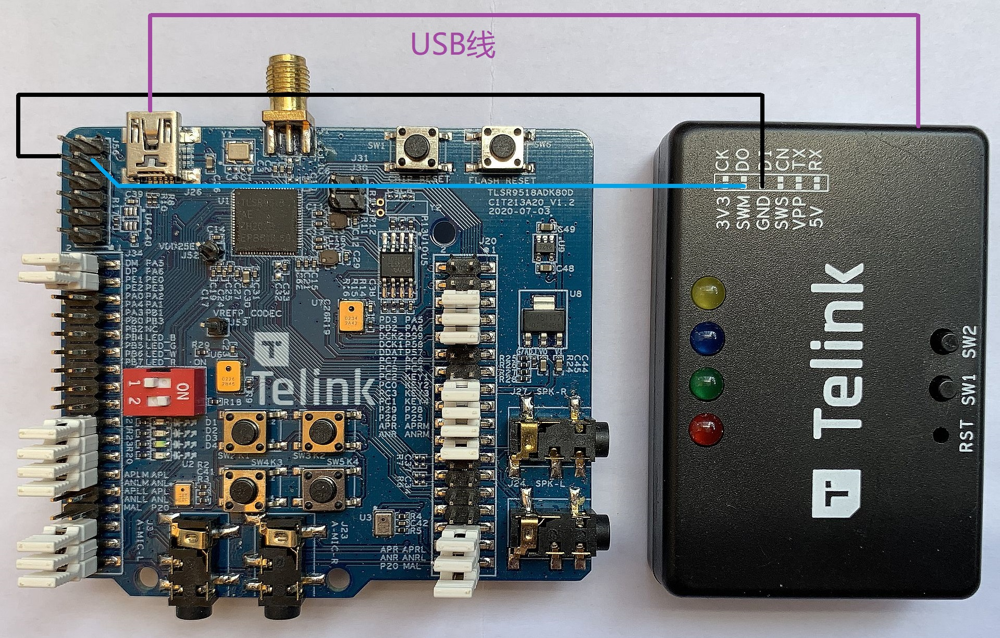

> 注意：务必采用默认的跳帽配置。

下图是完成所有硬件连接后状态：

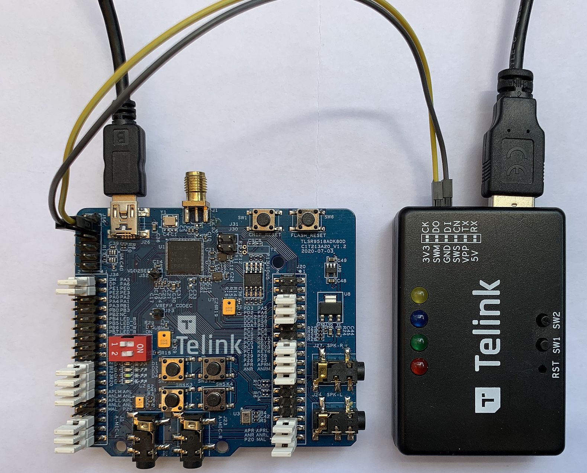

### 烧录

1. 用USB线连接烧录器到电脑的USB口。

2. 下载BDT烧录软件，解压到本地文件夹，双击可执行文件"Telink BDT.exe"。
如果一切正常，可以看到如下的窗口显示，在系统标题栏中可以看到已被连接的烧录器的设备信息（见图中红色框）。

    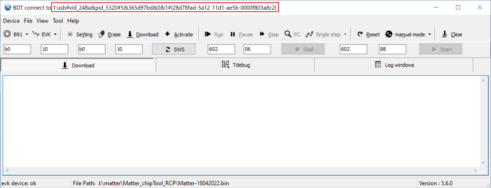

3. 点击工具栏中的"SWS"按钮，如果看到下图中的消息，则标明所有的硬件连接都没有问题。

    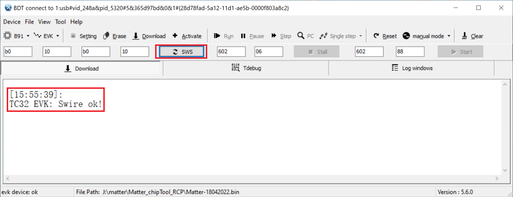

4. 设置Flash擦除的区域大小。点击工具栏中的"Setting"按钮，在弹出的“Setting"窗口中可以看到默认的Flash擦除的区域大小是512kB。

    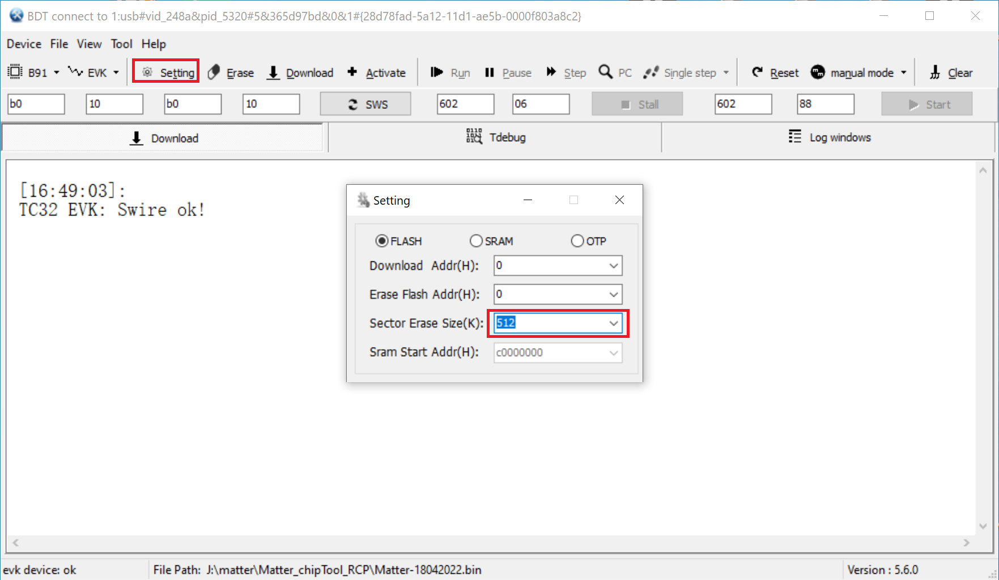

    将Flash擦除的区域大小设置为“2040”，如下图所示：

    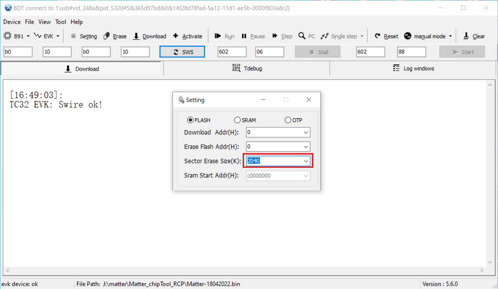

    > 注意：对于外挂2MB Flash的TLSR9518开发板，Flash最后的8kB空间预留用于保存重要的SoC信息，因此最多可以擦除2040kB的Flash区域。

5. 点击工具栏中的"Erase"按钮，等待Flash擦除操作完成。

    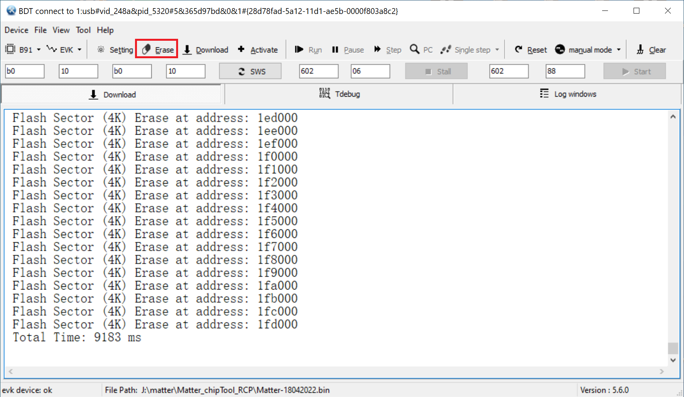

6. 选择需要烧录的BIN文件。点击"File"菜单里面的"Open"子菜单，在弹出的文件选择对话框中选中需要烧录的BIN文件。选中后的BIN文件将显示在底部的状态栏中。

    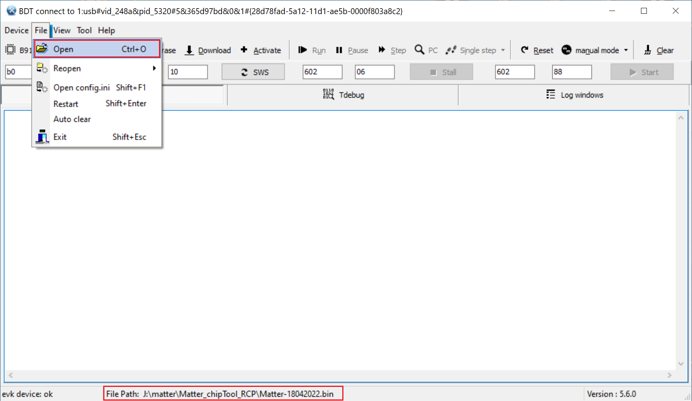

7. 点击工具栏中"Download"按钮，等待Flash烧录完成。

    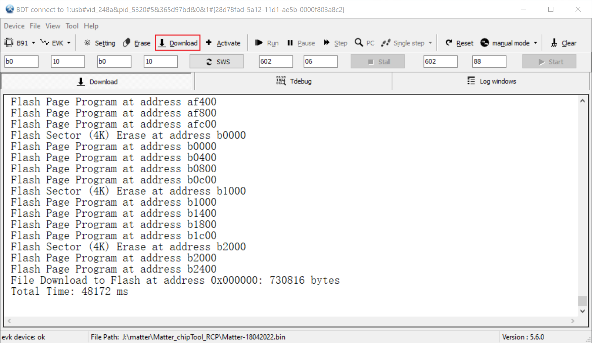

### 平台和驱动

烧录工具不需要安装额外的驱动程序。

如果烧录器插入电脑后，可以被Windows的设备管理器正确识别，但是烧录工具软件没有识别到，即在系统标题栏中看不到烧录器的设备信息。

请检查电脑是否用了AMD平台的处理器，如果是的话，请换一台Intel平台处理器的电脑重新尝试。

### 常见问题

最常见的问题是：在点击工具栏中的"SWS"按钮后，出现下图中的错误信息。

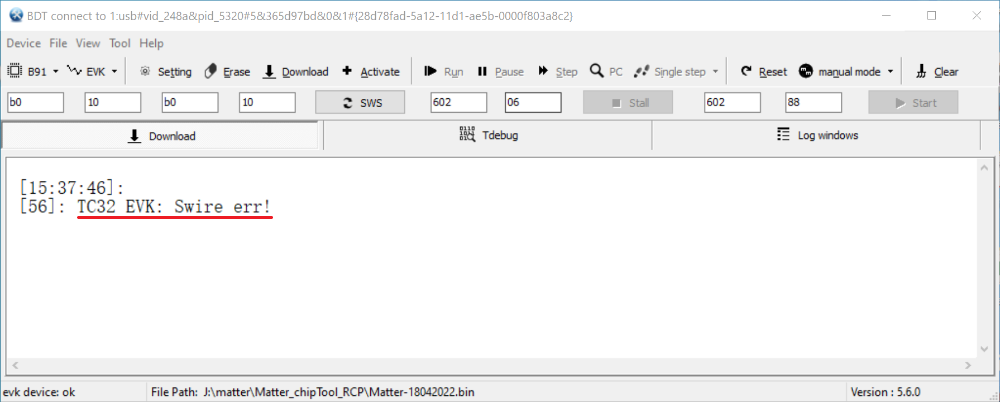

有两种主要原因。

- 第一种原因是硬件连接不正确。

请参照前面的说明仔细核对所有的[硬件连接](#连接硬件)，确认没有遗漏的连接。

- 在完全排除硬件连接问题之后，考虑第二种原因，即烧录器的固件版本太低。

请按照下面步骤查看烧录器固件的版本。

1. 点击Help菜单下的Upgrade子菜单。

2. 在弹出的Upgrade EVK窗口中，点击"Read FW Version"按钮。在旁边的"Firmware Version"区域将会显示烧录器的固件版本号，例如下图。
如果固件版本号低于V3.4，可以确认是由于固件版本太低导致了通讯错误。请继续下面的步骤去完成固件升级。

    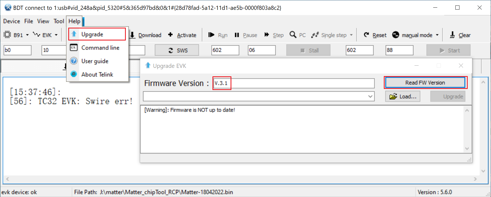

3. 点击窗口中的"Load..."按钮，在BDT工具所在目录下的config目录下的fw子目录找到最新的烧录器固件，如下图中的Firmware_v3.5.bin文件。

    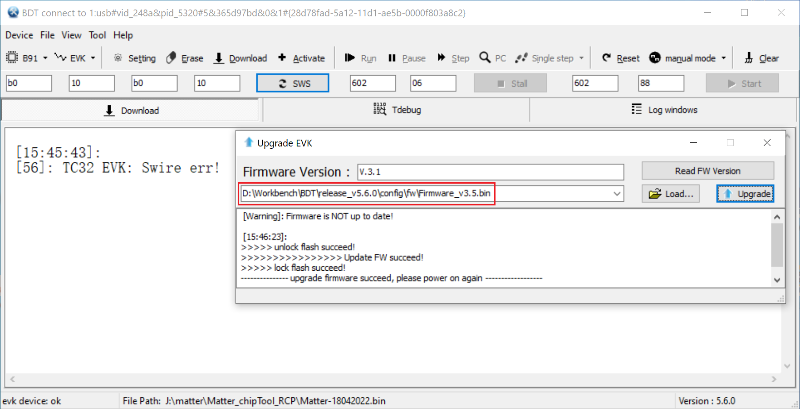

4. 点击Upgrade按钮完成烧录器固件升级。

5. 插拔烧录器的USB线，使烧录器重新上电。

**提示：** 更多BDT的使用说明，请参考[Burning and Debugging Tools for all Series](http://wiki.telink-semi.cn/wiki/IDE-and-Tools/Burning-and-Debugging-Tools-for-all-Series/)

## 相关仓库

演示样例：[vendor_telink](https://gitee.com/openharmony-sig/vendor_telink)

B91开发板：[device_board_telink](https://gitee.com/openharmony-sig/device_board_telink)
